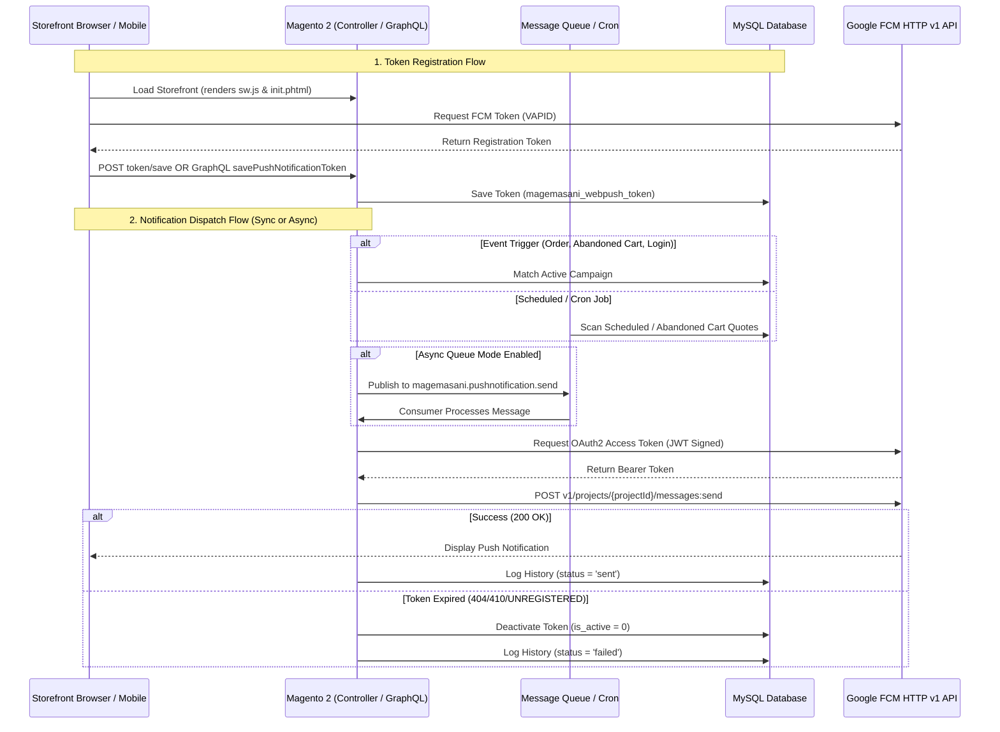

# MageMasani_PushNotification

`MageMasani_PushNotification` is an enterprise-grade Magento 2 extension that enables storing client push tokens and sending Push Notifications via **Google Firebase Cloud Messaging (FCM HTTP v1 API)**.

It provides out-of-the-box frontend service worker integration, automated event triggers (order status updates, customer registration, login/logout, newsletter subscriptions, birthday campaigns, abandoned cart recovery), background asynchronous message queue processing, a full-featured admin management suite, and complete GraphQL APIs for headless architectures (PWA Studio, Hyvä React, and native mobile apps).

---

## 🌟 Key Features

- **Direct FCM HTTP v1 REST API Integration**: Directly integrates with the modern Google FCM REST API using standard Magento PHP dependencies (`Magento\Framework\HTTP\Client\CurlFactory`).
- **Cryptographic JWT Signature**: Implements native PHP OAuth2 signature generation via `openssl_sign` using the Google Service Account private key with in-memory token caching to prevent redundant API hits.
- **Automated Event Triggers**:
  - 🛒 **Abandoned Cart Recovery**: Automatically scans inactive carts and sends push reminders with dynamic cart totals and restore links.
  - 📦 **Order Status Updates**: Real-time push updates when order status transitions (e.g. `processing`, `complete`).
  - 🎂 **Birthday Campaigns**: Daily automated push campaigns for customers celebrating birthdays.
  - 👤 **Customer Lifecycle Events**: Triggers for registration, login, logout, and customer group changes.
  - 📧 **Newsletter Subscriptions**: Notifications for subscription and cancellation events.
- **Asynchronous Message Queue Support**: Supports high-throughput push broadcasting via Magento Message Queue framework (MySQL / RabbitMQ) with consumer background processing (`magemasani.pushnotification.send`).
- **Admin Campaign & History Grids**:
  - **Manage Campaigns**: Full UI component grid & form to schedule recurring or event-driven campaigns with image uploader and dynamic placeholder hints.
  - **Notification History**: Audit log tracking sent timestamp, target customer, status (`sent`/`failed`), token counts, and error diagnostics.
  - **Token Registry**: Manage registered FCM tokens and device types.
  - **Push Test Center**: Manual push test sender in Admin panel.
- **Root-Scoped Service Worker**: Serves `sw.js` dynamically via `webpush/sw/index` with `Service-Worker-Allowed: /` headers for site-wide root scope registration without placing files in `pub/`.
- **GraphQL Ready**: Complete GraphQL API including `savePushNotificationToken` mutation and `PushNotificationHistoryInfo` query with customer authentication, pagination, and filter pool.
- **PHP 8.1 – 8.5 Fully Compatible**: Strict types, complete PHPDoc annotations, zero deprecated functions, and strict null safety.

---

## 📐 Architecture & Execution Flow



---

## 💻 Technical Requirements

- **PHP**: `~8.1.0 || ~8.2.0 || ~8.3.0 || ~8.4.0 || ~8.5.0` with `ext-openssl` and `ext-json`.
- **Magento**: Magento Open Source / Adobe Commerce `2.4.x`.
- **Firebase Project**: Valid Firebase Project with Cloud Messaging enabled.

---

## 📥 Installation

```bash
# Via Composer (if repository configured)
composer require magemasani/module-push-notification

# Or manually in app/code/MageMasani/PushNotification
bin/magento module:enable MageMasani_PushNotification
bin/magento setup:upgrade
bin/magento setup:di:compile
bin/magento setup:static-content:deploy -f
bin/magento cache:clean
```

---

## ⚙️ Configuration Guide

Navigate to **Stores > Configuration > MageMasani > Push Notification**:

### 1. General Settings
| Setting | Config Path | Description |
| :--- | :--- | :--- |
| **Enabled** | `pushnotification/general/enabled` | Enable or disable the push notification subsystem. |
| **Enable Asynchronous Sending** | `pushnotification/general/async_enabled` | When enabled, pushes are queued and sent in the background via Message Queue. |
| **Allowed Device Types** | `pushnotification/general/allowed_device_types` | Filter targeting (`web`, `api`, or `both`). |

### 2. Firebase Configuration
| Setting | Config Path | Description |
| :--- | :--- | :--- |
| **Firebase Config JSON** | `pushnotification/firebase/firebase_config_json` | Paste the `firebaseConfig` snippet from Firebase Console. Tolerates raw JS object literals. |
| **VAPID Public Key** | `pushnotification/firebase/vapid_key` | Obtained from *Firebase Console > Cloud Messaging > Web Push Certificates*. |
| **Service Account JSON** | `pushnotification/firebase/service_account_json` | Paste the Google Service Account JSON private key (*Project Settings > Service Accounts*). |
| **Default Notification Icon** | `pushnotification/firebase/icon` | Default icon for browser push banners (recommended: 192x192 PNG). |

### 3. Abandoned Cart Settings
| Setting | Config Path | Description |
| :--- | :--- | :--- |
| **Inactivity Delay (Minutes)** | `pushnotification/abandoned_cart/delay_minutes` | Inactivity threshold before cart is considered abandoned (default: 60 min). |
| **Maximum Cart Age (Days)** | `pushnotification/abandoned_cart/max_age_days` | Upper limit in days to search for abandoned carts (default: 7 days). |

---

## 🎯 Dynamic Placeholders

When authoring campaigns under **Marketing > Push Notification > Manage Campaigns**, use dynamic template variables:

| Event Type | Supported Placeholder Variables |
| :--- | :--- |
| **Abandoned Cart** (`abandoned_cart`) | `{{customer_name}}`, `{{items_count}}`, `{{grand_total}}`, `{{cart_url}}` |
| **Order Status** (`order_status`) | `{{customer_name}}`, `{{order_id}}`, `{{order_increment_id}}`, `{{order_status}}` |

---

## 🚀 Message Queue CLI

If **Asynchronous Sending** is enabled, run the consumer daemon in production via supervisor or systemd:

```bash
bin/magento queue:consumers:start magemasani.pushnotification.send.consumer
```

---

## 🔌 GraphQL API Reference

### 1. Save Token (Mutation)
```graphql
mutation {
  savePushNotificationToken(
    input: {
      token: "fcm_device_registration_token_here..."
      device_type: web
    }
  ) {
    success
    message
  }
}
```
*Note: Include `Authorization: Bearer <token>` to associate the device token with a customer account.*

### 2. Retrieve Notification History (Query)
```graphql
query {
  PushNotificationHistoryInfo(
    pageSize: 10
    currentPage: 1
    sort: { sent_at: DESC }
  ) {
    total_count
    page_info {
      current_page
      page_size
      total_pages
    }
    items {
      entity_id
      title
      body
      click_url
      image_url
      notification_type
      status
      sent_at
    }
  }
}
```

---

## 🗄️ Database Tables & Schema

| Table | Description | Primary / Unique Constraints | Foreign Keys (`ON DELETE SET NULL`) | High-Performance Indexes |
| :--- | :--- | :--- | :--- | :--- |
| `magemasani_webpush_token` | FCM device tokens and active statuses | `PRIMARY (entity_id)`<br>`UNIQUE (token)` | `customer_id` ➔ `customer_entity.entity_id`<br>`store_id` ➔ `store.store_id` | `(customer_id, is_active)`<br>`(device_type)` |
| `magemasani_pushnotification_campaign` | Push campaigns, event rules, and schedules | `PRIMARY (entity_id)` | — | `(status, notification_type, schedule_to, sent_at)`<br>`(status, notification_type, custom_event)` |
| `magemasani_pushnotification_history` | Delivery history, recipient logs, error diagnostics | `PRIMARY (entity_id)` | `customer_id` ➔ `customer_entity.entity_id`<br>`campaign_id` ➔ `magemasani_pushnotification_campaign.entity_id` | `(customer_id, notification_type, sent_at)`<br>`(campaign_id)`<br>`(sent_at)` |

---

## 📄 License

Open Source License (OSL 3.0). Created and maintained by **MageMasani**.
