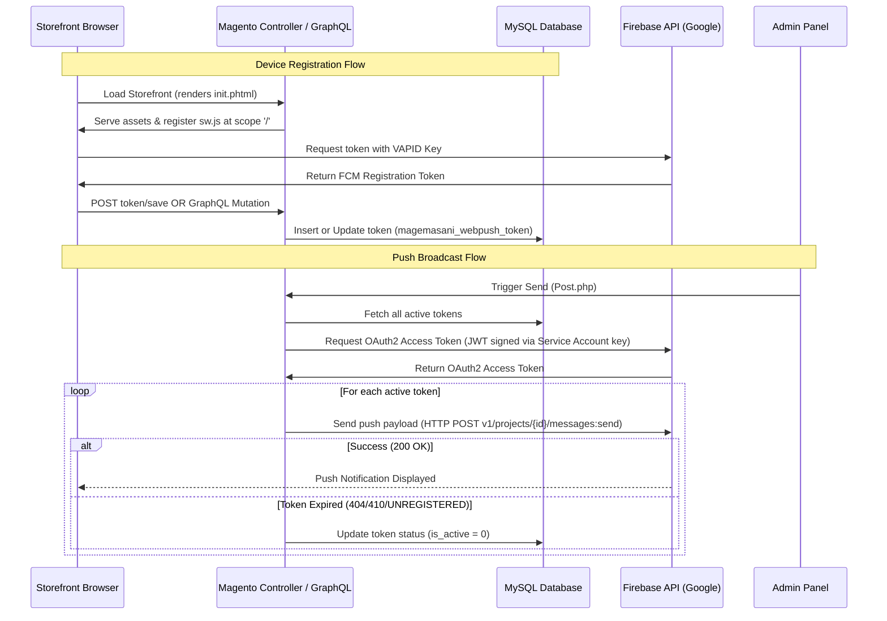

# MageMasani_WebPushNotification

`MageMasani_WebPushNotification` is a Magento 2 extension that enables storing client push tokens and sending Web Push Notifications via Google Firebase Cloud Messaging (FCM). It provides out-of-the-box frontend service worker integration, a clean administration panel for manual testing, and a GraphQL API schema to register device tokens for headless architectures (like PWA Studio, Hyvä React, or native mobile apps).

---

## Key Features

- **Direct FCM HTTP v1 REST Integration**: Integrates directly with the modern Google FCM REST API using standard Magento PHP dependencies (utilizing `Magento\Framework\HTTP\Client\CurlFactory`).
- **Cryptographic JWT Signature**: Implements native PHP OAuth2 signature generation via `openssl_sign` using the Google Service Account private key. It fetches and caches the required OAuth2 access tokens for 1 hour to prevent redundant external API hits.
- **Dynamic & Root-Scoped Service Worker**: Serves the Service Worker (`sw.js`) dynamically via `webpush/sw/index`. It injects security headers (`Service-Worker-Allowed: /`) allowing the service worker to be registered at the root scope (`/`) of the site. This avoids placing static files in Magento's `pub/` directory and complies with strict browser origin scope rules.
- **Robust JavaScript Object Parsing**: Stores a highly tolerant configuration parser. Admins can copy and paste the raw Javascript config object directly from the Firebase Console (which may contain unquoted keys, single quotes, comments, or trailing commas) and the helper will parse it correctly.
- **GraphQL Ready**: Exposes the `savePushNotificationToken` mutation, allowing mobile apps and headless storefront architectures to easily store client push tokens.
- **Admin Broadcast Center**: An admin panel under **Marketing > Communications > Web Push - Send Test** enables uploading rich push notification images, entering title/body copy, and broadcasting to all registered tokens.
- **Stale Token Pruning**: Automatically deactivates unregistered/stale browser tokens (`is_active = 0`) when the FCM server returns a `404`, `410`, or `UNREGISTERED` error code during push delivery.

---

## Architecture Flow



---

## Technical Requirements

- **PHP**: `ext-openssl` enabled (for JWT signature calculation using Google Service Account private keys).
- **Magento**: Compatibility verified on Magento Open Source / Adobe Commerce `2.4.x`.
- **Firebase Project**: A valid Firebase Project with Cloud Messaging enabled.

---

## Installation

Install the module manually into your Magento 2 environment:

1. Clone or copy the codebase to:
   ```path
   app/code/MageMasani/WebPushNotification
   ```
2. Enable the module and update your environment:
   ```bash
   bin/magento module:enable MageMasani_WebPushNotification
   bin/magento setup:upgrade
   bin/magento setup:di:compile
   bin/magento setup:static-content:deploy -f
   bin/magento cache:clean
   ```

---

## Database Design

The extension creates a database table called `magemasani_webpush_token` to track browser registrations.

```sql
CREATE TABLE `magemasani_webpush_token` (
  `entity_id` int(10) unsigned NOT NULL AUTO_INCREMENT COMMENT 'Entity ID',
  `customer_id` int(10) unsigned DEFAULT NULL COMMENT 'Customer ID',
  `token` varchar(512) NOT NULL COMMENT 'FCM Token',
  `user_agent` varchar(512) DEFAULT NULL COMMENT 'User Agent',
  `store_id` smallint(5) unsigned DEFAULT NULL COMMENT 'Store ID',
  `device_type` varchar(16) NOT NULL DEFAULT 'web' COMMENT 'Device Type: web|android|ios',
  `is_active` tinyint(1) NOT NULL DEFAULT 1 COMMENT 'Is Active',
  `created_at` timestamp NOT NULL DEFAULT CURRENT_TIMESTAMP COMMENT 'Created At',
  `updated_at` timestamp NOT NULL DEFAULT CURRENT_TIMESTAMP ON UPDATE CURRENT_TIMESTAMP COMMENT 'Updated At',
  PRIMARY KEY (`entity_id`),
  UNIQUE KEY `MAGEMASANI_WEBPUSH_TOKEN_TOKEN` (`token`),
  KEY `MAGEMASANI_WEBPUSH_TOKEN_CUSTOMER_ID` (`customer_id`),
  KEY `MAGEMASANI_WEBPUSH_TOKEN_DEVICE_TYPE` (`device_type`)
) ENGINE=InnoDB DEFAULT CHARSET=utf8;
```

---

## Configuration Guide

Configure the extension by navigating to **Stores > Configuration > MageMasani > Web Push Notification**:

| Setting | Path / Target | Description |
| :--- | :--- | :--- |
| **Enabled** | `webpushnotification/general/enabled` | Toggles storefront service worker script output. |
| **Firebase Config JSON** | `webpushnotification/firebase/firebase_config_json` | Copy the `firebaseConfig` object snippet from the Firebase Console (Project Settings > Web App Setup). Tolerates JS-object literal format directly. |
| **VAPID Public Key** | `webpushnotification/firebase/vapid_key` | Obtained from *Cloud Messaging > Web Push Certificates* in the Firebase Console. |
| **Service Account JSON** | `webpushnotification/firebase/service_account_json` | Paste the contents of your Google Service Account JSON private key file. Generated under *Project Settings > Service Accounts > Generate new private key*. |
| **Default Notification Icon**| `webpushnotification/firebase/icon` | Default icon shown in the browser push banners (typically a 192x192 PNG). |

---

## GraphQL Token Registry

Headless architectures can register client tokens using the native GraphQL mutation.

### Mutation
```graphql
mutation {
  savePushNotificationToken(
    input: {
      token: "eY9z_...YOUR_FCM_REGISTRATION_TOKEN..."
      device_type: web
    }
  ) {
    success
    message
  }
}
```

- **Allowed Device Types**: `web`, `android`, `ios`.
- **Authentication**: If run with an active Customer Authorization Bearer Token, the token is automatically linked to the logged-in customer's `customer_id`. Otherwise, it is stored as a guest token.

---

## Developer Reference & Testing

### 1. Storefront Asset Handlers
To prevent browser CORS or Service Worker directory restriction errors, the module uses dynamic controllers to proxy assets:
- **`webpush/sw/index`**: Serves `sw.js` with correct `Service-Worker-Allowed` headers.
- **`webpush/asset/app`**: Serves raw Firebase App JS SDK asset.
- **`webpush/asset/messaging`**: Serves raw Firebase Messaging JS SDK asset.

### 2. Tolerant JSON Decoding
The extension's configuration helper utilizes a tolerant JSON parser to filter standard copy-pasted JavaScript configuration formats.
```php
// Decodes and processes:
const firebaseConfig = {
    apiKey: "AIzaSy...",
    authDomain: "project-123.firebaseapp.com", // comments are stripped
    projectId: "project-123",
};
```

### 3. Sending Broadcasts / Test Notifications
1. Go to **Marketing > Communications > Web Push - Send Test** in Magento Admin.
2. Enter the **Title** and **Body**.
3. (Optional) Select a local image file to upload. This image will automatically be moved to the Magento media folder (`pub/media/webpush/`) and sent as the notification rich media attachment.
4. Click **Send Notification**.
5. Check Magento system messages for success/failure rates and detailed API logs. Stale client tokens are marked inactive during this cycle.
